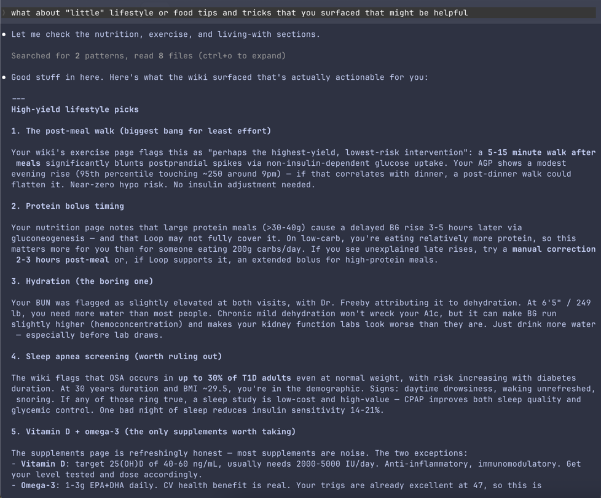

# hstack (health stack)

A stack of tools and agents built to help those who use LLMs as healthcare advisors. [Read more on my blog](https://kamens.com/blog/llm-wiki-for-fighting-disease).

I find myself constantly talking to LLMs when dealing with health situations on behalf of family, extended family, extended-extended family, friends...

Interpreting results, preparing questions for the next doctor visit, simplifying medical-speak, understanding the nuance in diagnoses, mapping out treatment options, summarizing bleeding-edge research, spotting what's falling through the cracks.

Inspired by the unreasonable effectiveness of [Garry Tan's gstack](https://github.com/garrytan/gstack), Every's [Compound Engineering plugin](https://github.com/EveryInc/compound-engineering-plugin), and [Andrej Karpathy's LLM Wiki pattern](https://gist.github.com/karpathy/442a6bf555914893e9891c11519de94f), **hstack is a collection of tools and agent specialists built to help those who use LLMs as healthcare advisors.** It's not a doctor — but it'll help you better understand them, communicate with them, interpret your own results, and make more informed decisions about your care.

For someone dealing with a specific disease, hstack can also build a personal, disease-specific wiki — the kind of thing you'd have if a brilliant doctor who both knows your case AND has your disease spent weeks organizing everything they know into one navigable place for you. Current research, treatment options, frontier science, lifestyle interventions, patient community wisdom — compiled from real sources, organized in [Obsidian](https://obsidian.md), and kept up to date.

**Who this is for:**
- **Patients and caregivers** — anyone navigating a health situation for themselves or someone they love
- **The family health researcher** — the person everyone calls when they get confusing test results or need help understanding a diagnosis
- **Anyone who already uses LLMs for health questions** — and wants structured tools instead of starting from scratch every time

## Quick start

1. Install hstack (30 seconds — see below)
2. Run `/hstack-discuss-case` — describe something you're worried about. See how it responds.
3. Run `/hstack-understand-results` — paste some test results or a diagnosis you've received.
4. Run `/hstack-wiki-init` — give it a disease name and watch it build you a comprehensive Obsidian wiki.

## Install

Open Claude Code and paste this. Claude does the rest.

> Install hstack: clone the repo with **`git clone https://github.com/kamens/hstack ~/.claude/skills/hstack`**, then use AskUserQuestion to ask whether I want skills installed globally or project-locally. Then run `~/.claude/skills/hstack/install.sh --global` or `~/.claude/skills/hstack/install.sh --project` based on my answer.

Start a new Claude Code session and the `/hstack-*` commands are available immediately.

Or run it yourself in a terminal — `git clone` then `./install.sh` and it'll walk you through it.

## Your specialists

Agent specialists, each with a specific role. They all share the same foundational voice — a battle-hardened ER doc who's also a patient advocate, a clinical results interpreter, and a scout for the latest R&D — but each brings a different expertise to the conversation.

| Skill | Your specialist | What they do |
|-------|----------------|--------------|
| `/hstack-prepare-for-visit` | **Patient Advocate** | Builds your appointment agenda — prioritized questions to ask, things to bring, what to expect, medical terms you'll hear, and red flags to listen for. You'll walk in more prepared than most patients. |
| `/hstack-understand-results` | **Results Interpreter** | Breaks down test results and diagnoses — what the numbers actually mean, what's normal vs. notable, likely next steps, and what NOT to Google at 2am. Separates the signal from the noise. |
| `/hstack-summarize-research` | **Latest R&D Scout** | Synthesizes the cutting edge of medical research — what's proven and available now, what's in clinical trials, what's early-stage, and what's hype. Brings back actionable intelligence for your next doctor conversation. |
| `/hstack-discuss-case` | **ER Doc on Call** | The 3am tool. Something is happening and you need to know: is this normal, or do I need to act? Gives a clear red/yellow/green assessment — and knows when "you're okay" is the right answer. |

Each specialist consults behind-the-scenes clinical subagents (a triage specialist, a lab interpreter, a research analyst, a medical information specialist), then delivers the findings with appropriate warmth.

## Your personal disease wiki

Following [Karpathy's LLM Wiki pattern](https://gist.github.com/karpathy/442a6bf555914893e9891c11519de94f): collect real sources, compile them into organized interlinked pages, and let the LLM maintain everything. The human curates sources, directs the analysis, and asks good questions. The LLM does the bookkeeping.

| Skill | What it does |
|-------|-------------|
| `/hstack-wiki-init` | Bootstraps a disease wiki from scratch. Searches the web for real sources — research papers, trial results, treatment guidelines, patient community threads — saves them to `raw/`, then compiles everything into an organized, interlinked Obsidian vault. |
| `/hstack-wiki-ingest` | Processes files you drop into `raw/` — personal lab results, doctor's notes, articles you found interesting. Interprets them, weaves them into the wiki, cross-references with existing content. |
| `/hstack-wiki-refresh` | Re-researches the landscape and updates the wiki with what's changed. Broad ("refresh everything") or focused ("refresh with the latest GLP-1 data for T1D"). Collects new sources first, then compiles updates. |
| `/hstack-wiki-lint` | Health-checks the wiki for broken links, missing cross-references, stale content, contradictions, and gaps. Auto-fixes structural issues, flags content issues for you. |
| `/hstack-wiki-battle-plan` | Reads the entire wiki and your personal data, then creates a proactive, prioritized battle plan — tiered from clinically validated down to long-tail internet wisdom. If a prior plan exists, highlights what changed and why. |

**Core principles:**

- **Source-first.** The wiki is compiled from real documents saved in `raw/`, not synthesized from LLM knowledge. This produces richer content and verifiable claims.
- **Emergent organization.** Folder structure comes from the content, not a prescribed template. The wiki organizes itself around what the sources actually cover.
- **Progressive disclosure.** Every folder has a summary (`_index.md`) so both humans and LLMs can navigate without reading everything.
- **Your data stays yours.** Personal health documents in `raw/` are never modified. Wiki pages link back to the originals. When you ask about your results, the LLM reads the raw source, not just its own interpretation.
- **Explorations compound.** When a conversation produces a valuable analysis, the wiki offers to save it as a new page. Your questions make the wiki better over time.

To use the wiki, open the vault folder in Obsidian and browse — or start a Claude Code session in the vault directory and ask questions. The vault's `CLAUDE.md` tells Claude to ground its answers in the wiki's content, not training data.

## See it work

Real example using `/hstack-prepare-for-visit`:

```
You:    /hstack-prepare-for-visit
        8 year old daughter has intense leg pain from hip to knee.
        Struggled to walk but otherwise doesn't look sick. Urgent care
        took xray and flu/covid tests — nothing came up. Told us to
        monitor for septic infection in hip, which sounds scary.
        Should I take her to ER? What do I ask?

hstack: [asks about recent illness, fever, when pain started, whether
         she can bear any weight...]

        [dispatches medical research specialist — researches pediatric
         hip pain differentials, Kocher criteria, ER protocols...]

        I'm an AI, not your daughter's doctor — but I can help you
        think through this clearly, because right now you're scared
        and that's making everything feel more urgent than it may be.

        ASSESSMENT: PROBABLY NOT AN EMERGENCY — BUT GETTING LABS IS SMART

        The most likely diagnosis is transient synovitis — basically,
        temporary inflammation of the hip joint. It's the single most
        common cause of acute hip pain in kids your daughter's age. It
        often follows a viral illness, causes exactly what you're
        describing (hip-to-knee pain, limping, kid otherwise looks
        fine), and it resolves on its own in about a week with rest
        and ibuprofen.

        The reason urgent care mentioned septic arthritis is because
        it's the one thing they have to rule out — it's rare, but it's
        a surgical emergency if missed. That's why getting labs is
        smart — "monitor for it" and "she probably has it" are very
        different things.

        Here's what's reassuring about your daughter's situation:
        - No fever — this is the big one
        - She doesn't look sick
        - She can bear some weight
        - X-ray was normal

        Your daughter likely meets 0-1 of 4 Kocher criteria, which puts
        the probability of septic arthritis at less than 3%.

        ...

        SHOULD YOU GO TO THE ER?

        Go now if: fever develops, can't bear weight at all, starts
        looking sick, or pain isn't helped by ibuprofen.

        OK to see pediatrician in the morning if: no fever, resting
        comfortably, bearing some weight, acting like herself.

        ...

        MUST-ASK QUESTIONS

        1. "Can we get a CBC, CRP, and ESR?" — if all normal, septic
           arthritis is essentially ruled out.
        2. "Can we get a hip ultrasound?" — no fluid = very reassuring.
        3. "What's her Kocher criteria score?" — tells the doctor you
           want a real number, not just "we're monitoring."
        4. "What specific symptoms should bring us back immediately?"
        5. "Should we follow up with pediatric orthopedics?"

        ...

        WORDS YOU'LL HEAR

        Transient synovitis — temporary hip inflammation. Most likely
            diagnosis. Goes away on its own.
        Septic arthritis — bacterial joint infection. Rare but serious.
        Effusion — fluid in the joint. Present in both — so fluid
            alone doesn't mean infection.
        Kocher criteria — 4-factor scoring system that predicts
            probability of septic arthritis.
        CRP / ESR — blood inflammation markers. Normal = very reassuring.
        Arthrotomy — surgical joint cleaning. Sounds scary but excellent
            outcomes in kids.

        ...

        ABOUT THE SURGERY FEAR

        If — and this is a big "if" — she did have septic arthritis:
        it's a joint washout, not a replacement. Kids bounce back fast.
        Full recovery is the expected outcome with early treatment.

        You went to urgent care today and are asking these questions
        tonight. You're already ahead of the curve.

        TONIGHT'S GAME PLAN

        1. Ibuprofen at the right dose for her weight
        2. Check temperature every 3-4 hours
        3. Watch for red flags above
        4. Pediatrician first thing in the morning — or ER tonight if
           you won't sleep otherwise
        5. "Parent can't sleep" is a legitimate reason to go to the ER
```

### Querying a disease wiki

Asking a T1D wiki about actionable lifestyle tips — it pulls from the nutrition, exercise, and living-with sections, cross-references personal lab data, and gives specific, wiki-grounded recommendations:



## Important

hstack is an AI tool, not a doctor. It can help you understand medical information, prepare better questions, and think through health situations more clearly — but it cannot examine you, run tests, or replace professional medical care. Use it as a thinking partner, not a substitute for real medical advice. The authors are not liable for decisions made based on its output.

If you or someone you know is in crisis, call emergency services or a crisis hotline.

## How it works

Each command is a carefully crafted prompt (a SKILL.md file) that shapes how Claude responds to health questions. The prompts share a common voice defined in `shared/preamble.md` — the battle-hardened ER doc persona, a calibrated red/yellow/green escalation framework, anxiety-aware communication patterns, and safety protocols including mental health crisis detection.

Specialists that benefit from clinical separation dispatch subagents — a triage specialist or lab interpreter runs in a separate context to give an unbiased clinical assessment, then the main skill wraps it in empathetic delivery. The clinical truth and the human delivery are handled separately so neither compromises the other.

The wiki skills share additional conventions defined in `shared/wiki_schema.md` — source-first compilation, emergent organization, progressive disclosure, and evidence tier labeling. They use [kepano/obsidian-skills](https://github.com/kepano/obsidian-skills) for Obsidian formatting (fetched automatically at build time) and [defuddle](https://github.com/nicholasgriffintn/defuddle) for clean web content extraction.

## Development

Requires [bun](https://bun.sh/).

```bash
# Generate SKILL.md files from templates
bun run gen:skill-docs

# Run structural validation tests (free, <1s)
bun test test/skill-validation.test.ts

# Run LLM quality checks (requires ANTHROPIC_API_KEY, ~$0.10/run)
bun test test/skill-llm-eval.test.ts

# Run all tests
bun test
```

## How to add a skill

Adding a new specialist takes about 10 minutes:

1. Create a directory with an `hstack-` prefix:

```bash
mkdir hstack-your-skill-name
```

2. Create `SKILL.md.tmpl` with this structure:

```yaml
---
name: hstack-your-skill-name
description: |
  What this skill does and when to use it.
---

{{PREAMBLE}}

# Your Skill Title

**You are the patient's [specialist role].** One sentence that captures
what this specialist does and why the patient needs them.

Your skill instructions here. Write them as natural language guidance
for Claude — what questions to ask, how to structure the response,
when to dispatch subagents for clinical separation.
```

The `{{PREAMBLE}}` placeholder is required — it injects the shared voice, escalation framework, and safety protocols that all specialists share. Wiki skills also use `{{WIKI_SCHEMA}}`, `{{OBSIDIAN_MARKDOWN}}`, and `{{DEFUDDLE}}`.

3. Generate and test:

```bash
bun run gen:skill-docs
bun test test/skill-validation.test.ts
```

4. Try it in Claude Code — the skill appears as `/hstack-your-skill-name`.

5. Add an LLM eval test case in `test/skill-llm-eval.test.ts` with a focus area description for the judge.

## License

MIT. Free forever. Go help someone.
